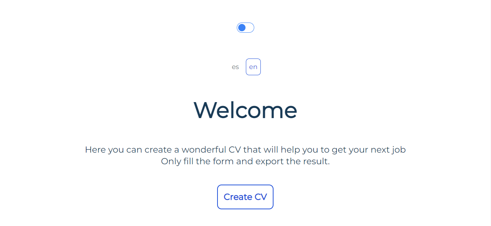
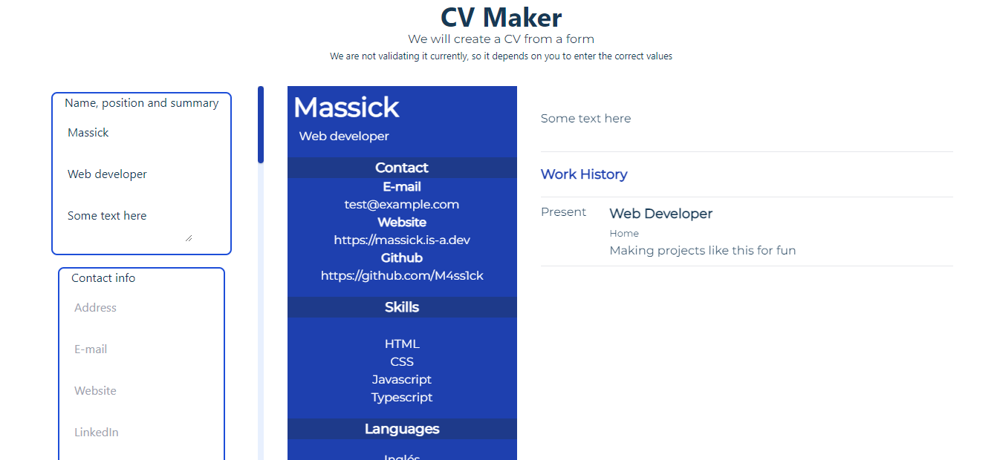

# TL;DR

¿Seriously? They are only a few paragraphs...

# History

This time I bring you another of my pages: a simple CV generator. Some time ago I was looking for one and the ones I liked were not free, so for those who thought the same, I created my own.

# How does it works

From the data you enter in a form on the left, your CV is automatically generated on the right, it doesn't get any simpler than that!

# Features

- Dark mode (In case you want your resume to be different with an almost black background)
- Multilanguage (Spanish and English).
- Export the result. Obviously, there is no point in creating it and not being able to do anything with it. (You should not do it on the mobile, because what the page actually does internally is to make a screenshot of your CV and on the mobile it doesn't look _cool at all_).

- It's open source, you can find it [in github](https://github.com/M4ss1ck/gatsby-cv-maker).

Without further ado, [here is the app](https://cool-cv-maker.netlify.app/en/). I welcome any suggestions, I know it is still green and I would like to improve it through feedback with users.

_Thank you!_

# Technical Data

- Almost fully written in Typescript, using [Gatsby](https://www.gatsbyjs.org/).
- [Tailwind CSS](https://tailwindcss.com/) for styling.
- Hosted on [Netlify](https://www.netlify.com/).
