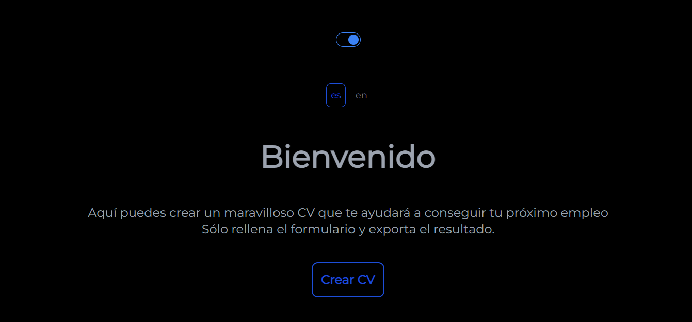
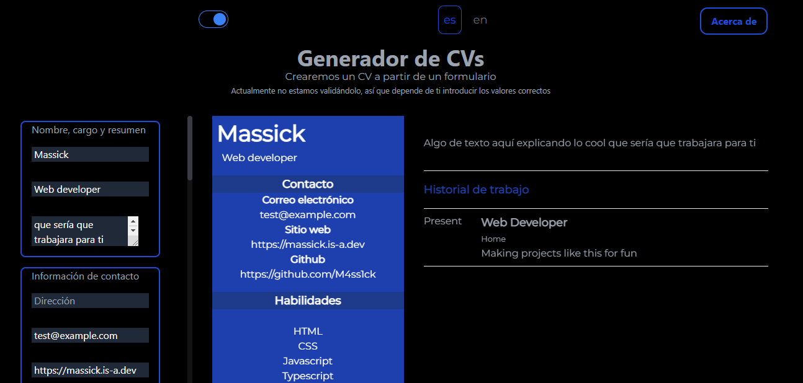

# TL;DR

¿En serio? Si son cuatro parrafitos de nada...

# Historia

Esta vez les traigo otra de mis páginas: un sencillo generador de CV. Hace algún tiempo estuve buscando alguno y los que me gustaban no eran gratuitos, así que para aquellos que pensaran igual, creé el mío propio.

# Cómo funciona

A partir de los datos que ingreses en un formulario a la izquierda, se genera automáticamente tu CV a la derecha, no puede ser más simple que eso!

# Algunas características:

- Modo oscuro (Por si quieres que tu currículo sea diferente con un fondo casi negro)
- Multilenguaje (Te creas una copia en español y otra en inglés, siempre se recomienda hacer esto último)
- Exporta el resultado. Obvio, de nada sirve crearlo y no poder hacer nada con él. (No debes hacerlo en el móvil, ya que en realidad lo que hace la página internamente es realizarle una captura a tu CV y en el móvil queda en forma de columna)

- Es de código abierto, lo puedes encontrar [en github](https://github.com/M4ss1ck/gatsby-cv-maker). (Puedes modificarlo, replicarlo o lo que desees)

Sin más, [aquí está la página](https://cool-cv-maker.netlify.app/). Agradezco cualquier sugerencia, sé que aún está verde y me gustaría mejorarla a través de la retroalimentación con los usuarios.

Muchas gracias!

# Datos Técnicos

- Está escrito casi totalmente en Typescript, usando [Gatsby](https://www.gatsbyjs.org/).
- Para los estilos se usó [Tailwind CSS](https://tailwindcss.com/).
- Para el alojamiento se usó [Netlify](https://www.netlify.com/).
