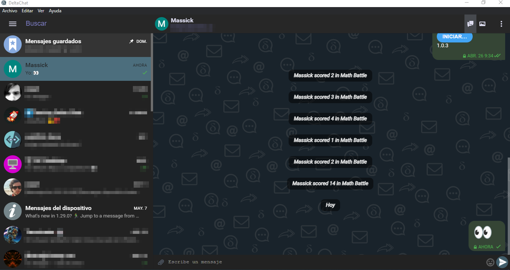
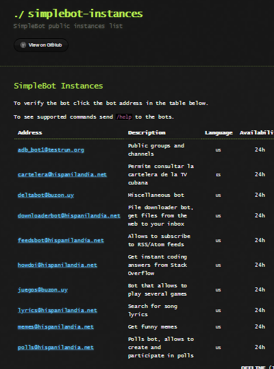
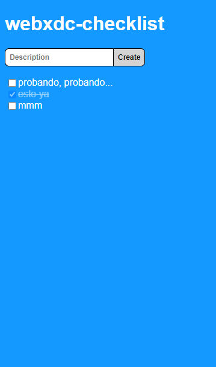

# What's Delta Chat

Like they say in their [homepage](https://delta.chat/en/):

> It’s like Telegram or WhatsApp, but without tracking or central control.

It has the features of the best chat applications (with some extras), all that without any central server or phone number required. If you care about privacy (which you should and should care a lot) you need to know (and use) Delta Chat.

# How to use Delta Chat

You only need an email account to start using it. Not all email providers can be used, and some require additional configuration (such as [Gmail](https://providers.delta.chat/gmail)). This information can be found [here](https://providers.delta.chat/).

It is important to note that the person you are chatting with does not have to use Delta Chat, they can use any email client. This makes it the application with the largest user base in the world.

# Main features

We could think of it as Telegram but over email, in addition to being completely free and open source.

<!--  -->

## Basic operations

Send text messages (🙄), audio messages, photos, videos, files, etc; record audio messages, video messages; take photos, edit them before sending... and other features that I don't remember now, we are talking about functions that any instant messaging application should have.

**Note:** at the moment it is not possible to attach more than one file per message.

## Multi-platform

You can use it on PC, mobile, tablet.... and even on the steam deck 🚶. It is available in all major stores, and you can download the source code too. The links are on their [download page](https://delta.chat/en/download).

You can use it on several devices at the same time, instructions [here](https://delta.chat/en/help#multiclient).

## Compatible

Just like that. I mentioned it before: if someone has an email address, they can write to you on Delta Chat and in turn can receive your messages. Of course, the real potential is unlocked when everyone uses Delta Chat.

## Encryption

Delta Chat uses [Atocrypt](https://autocrypt.org/), an end-to-end encryption for email. It requires no configuration by the user (although it can be disabled in the settings) but all chat partners must use Autocrypt-compliant email applications.

This encryption protects us from passive attacks. For active attacks, there are also verified contacts and groups (using [countermitm](https://countermitm.readthedocs.io/en/latest/new.html)).

## Speed

This depends on the provider you are using, but generally sending and receiving messages is quite fast. In the case of [Nauta](https://providers.delta.chat/nauta-cu) mail, it is practically instant.

## Bots

The functionality of the application can be extended with bots created by the community. The best example is [Simplebot](https://github.com/simplebot-org/simplebot), which has a [list of instances](https://simplebot-org.github.io/simplebot-instances/) to choose from.

With these bot we can, among other things, use services such as Mastodon, IRC or Telegram through Delta Chat. We can also use them to translate texts, download stickers, upload files to a cloud, download memes...

In addition, you can create your own bot, or set up your own Simplebot instance using plugins of your choice.

In the image above I consult the GamesBot help (`/help`), use `/list` to see the available games, download Snake and make 20 points on it. All without leaving Delta Chat.

## Webxdc

This is one of the latest features added to Delta Chat. These are web applications that allow communication between users in the same group. Its main uses are games (single player with shared scoreboard or turn-based multiplayer) or productivity applications (polls, interactive document editors, etc).

To use them you only have to send the `.xdc` file to the chat you want. Or you can also use a bot designed for that purpose, as I did before.

This is a list in which all members of a project can, for example, write down what remains to be done and check what is being done:

With webxdc you can also entertain yourself with games like Exquisite Corpse, creating true literary gems with your friends.

# Conclusions

I could use a table to compare Delta Chat with Telegram, WhatsApp, Signal, etc, and I still have time, but I think it is not necessary, because this application does not collide with any of them. Even if you already have a favorite mail client that you are very fond of, you can use Delta Chat without any problems for mails you receive from another Delta Chat user, with all the advantages that this brings.

This was not an exhaustive list, I am convinced that I have forgotten features, but I did show the most important ones in my opinion that make Delta Chat an application to take into account.
