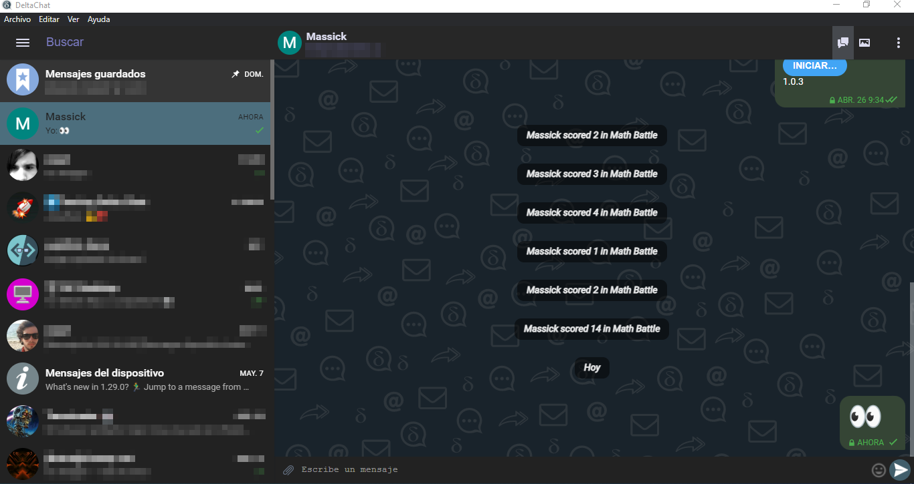
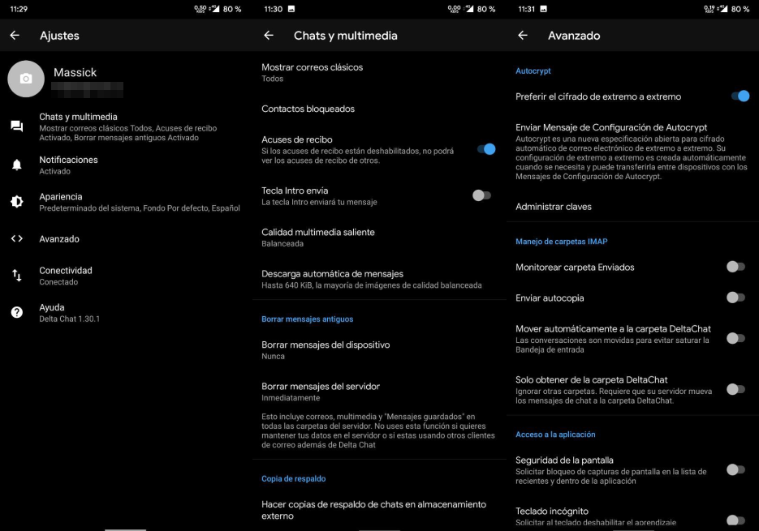
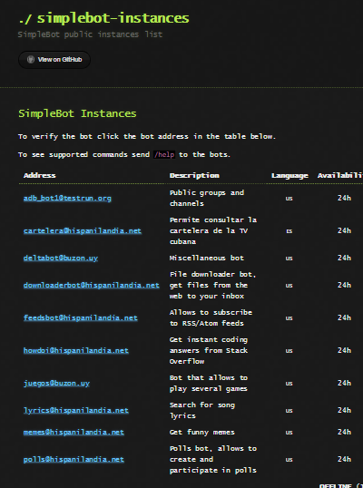
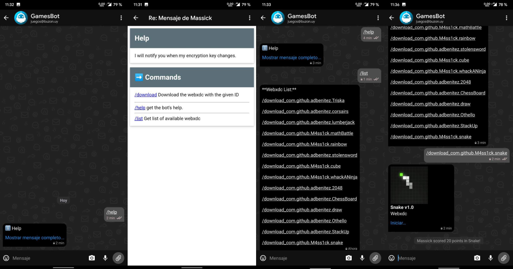
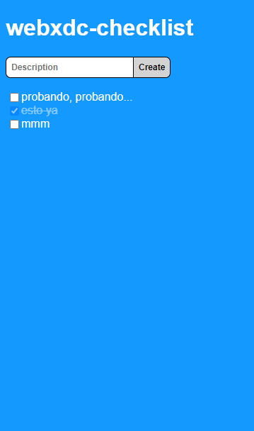
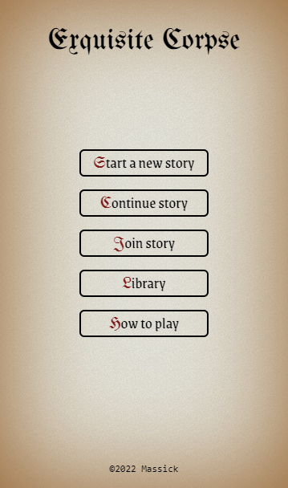

# Qué es Delta Chat

Como dicen en su [página oficial en español](https://delta.chat/es/):

> Delta Chat es como Telegram o Whatsapp pero sin el rastreo o el control central.

Tiene las características de las mejores aplicaciones de chat (con algunos extras), todo eso sin ningún servidor central ni número de teléfono. Si te interesa la privacidad (que debería interesarte y mucho) tienes que conocer (y utilizar) Delta Chat.

# Cómo usar Delta Chat

Sólo necesitas una cuenta de correo eléctronico para comenzar a usarla. No todos los proveedores de correo pueden utilizarse, y algunos necesitan configuración adicional (como es el caso de [Gmail](https://providers.delta.chat/gmail)). Esa información la puedes consultar [aquí](https://providers.delta.chat/).

Es importante resaltar que la persona con la que converses no tiene que usar Delta Chat obligatoriamente, puede utilizar cualquier cliente de correo electrónico. Esto la convierte en la aplicación con la base de usuarios más grande del mundo.

# Principales características

Podríamos pensar que se trata de Telegram pero usando correo electrónico, además de ser completamente gratis y de código abierto.

## Funciones básicas

Enviar mensajes de texto (🙄), mensajes de audio, fotos, videos, archivos, etc; grabar mensajes de audio, mensajes de video; realizar fotos, editarlas antes de enviar... y otras características que ahora no recuerdo, estamos hablando de funciones que cualquier aplicación de mensajería instantánea debería poseer.

**Nota:** de momento no es posible adjuntar más de un fichero por mensaje.

## Multiplataforma

Puedes utilizarla en la PC, el móvil, la tablet... e incluso en la steam deck 🚶‍♂️. Se encuentra en las principales tiendas, e incluso puedes descargar el código fuente. Los enlaces están en su [página de descargas](https://delta.chat/es/download).

Puedes incluso usarla en varios dispositivos a la vez, las instrucciones [aquí](https://delta.chat/es/help#multiclient).

## Compatible

Así, a secas. Ya lo mencionaba antes: si alguien tiene una dirección de correo, te puede escribir a Delta Chat y a su vez puede recibir tus mensajes. Por supuesto, el verdadero potencial se aprovecha cuando todos usan Delta Chat.

## Cifrado

Delta Chat usa [Autocrypt](https://autocrypt.org/), un cifrado de extremo a extremo para el correo electrónico. No necesita configuración por parte del usuario (aunque se puede deshabilitar en las opciones) pero todos los compañeros de chat deben usar aplicaciones de correo electrónico compatibles con Autocrypt.

Este cifrado nos protege de los ataques pasivos. Para el caso de ataques activos, existen también los contactos y grupos verificados (usando [countermitm](https://countermitm.readthedocs.io/en/latest/new.html), documentación en inglés)

## Velocidad

Aquí depende del proveedor que estés utilizando, pero por lo general enviar y recibir mensajes es bastante rápido. En el caso de [Nauta](https://providers.delta.chat/nauta-cu), es prácticamente instantáneo.

## Bots

Las funcionalidades de la aplicación se pueden extender con bots creados por la comunidad. El mejor ejemplo es [Simplebot](https://github.com/simplebot-org/simplebot), del que contamos con una [lista de instancias](https://simplebot-org.github.io/simplebot-instances/) para escoger.

Con estos bot podemos, entre otras cosas, usar servicios como Mastodon, IRC o Telegram desde Delta Chat. Podemos usarlos también para traducir textos, descargar stickers, subir archivos a una nube, descargar memes...

Además, puedes crear tu propio bot, o montar tu propia instancia de Simplebot usando los complementos (plugins) que prefieras.

En la imagen anterior consulto la ayuda de GamesBot (`/help`), uso `/list` para ver los juegos disponibles, descargo Snake y hago 20 puntos en él. Todo sin salir de Delta Chat.

## Webxdc

Esta es una de las últimas características que se le agregaron a Delta Chat. Se trata de aplicaciones web que permiten la comunicación entre usuarios de un mismo grupo. Sus principales aplicaciones son los juegos (de un solo jugador pero con tabla de puntuación compartida o multijugador por turnos) o aplicaciones para productividad (encuestas, editores de documentos interactivos, etc).

Para usarlas sólo debes enviar el archivo (de extensión `.xdc`) al chat que desees. O también puedes usar algún bot diseñado con ese fin, como hice anteriormente.

Esta es una lista en la que todos los miembros de un proyecto pueden anotar lo que falta por hacer y tachar lo que se vaya realizando.

Con webxdc también puedes entretenerte con juegos como Cadáver Exquisito, creando verdaderas joyas de la literatura con tus amistades.

# Conclusiones

Podría utilizar una tabla para comparar Delta Chat con Telegram, WhatsApp, Signal, etc, y todavía estoy a tiempo, pero creo que no es necesario, porque esta aplicación no entra en conflicto con ninguna de ellas. Incluso si ya tienes un cliente de correo preferido al que le tengas mucho cariño, puedes utilizar Delta Chat sin problemas para los correos que recibas desde otro Delta Chat, con todas las ventajas que esto conlleva.

Esta no ha sido una lista exhaustiva, estoy convencido de que he olvidado caracterísiticas, pero sí mostré las más importantes a mi juicio y que convierten a Delta Chat en una aplicación a tener en cuenta.
