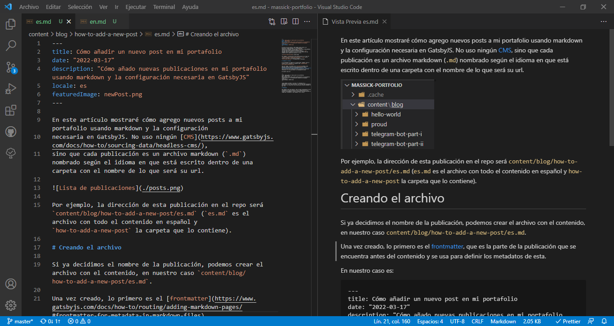

In this article I will show you how I add new posts to my portfolio using markdown and the configuration
necessary in GatsbyJS. I do not use any [CMS](https://www.gatsbyjs.com/docs/how-to/sourcing-data/headless-cms/),
instead each post is a markdown file (`.md`) named according to the language it is written in inside a folder with the name of what will be its url.


For example, the address of this post in the repo will be `content/blog/how-to-add-a-new-post/en.md` (`en.md` is the file with all the english content and `how-to-add-a-new-post` the folder containing it).

# Creating the file

If we have already decided the name of the post, we can create the file with the content, in our case `content/blog/how-to-add-a-new-post/en.md`.

Once created, the first thing is the [frontmatter](https://www.gatsbyjs.com/docs/how-to/routing/adding-markdown-pages/#frontmatter-for-metadata-in-markdown-files),
which is the part of the post that comes before the content and is used to define the metadata of the post.

In our case it is:

```
---
title: How to add a new publication in my portfolio
date: "2022-03-17"
description: "How do I add new posts in my portfolio using markdown and configure GatsbyJS properly"
locale: en
featuredImage: newPost.png
---
```

> `featuredImage` is an image that will be used as a thumbnail for the post and is located in the same folder as this file.

Then we can proceed to write the content of the post. We can use images and other types of files that we add to the folder where the markdown file is located.

In my particular case, I use VS Code as my main tool and its preview function for markdown files is very useful.



Once finished, when saving the file, GatsbyJS will create a web page with the content of the publication using `gatsby build` (or `gatsby develop`). Now we will see how this is possible.

# GatsbyJS configuration

In order for Gatsby to be able to use our markdown files correctly to create blog posts, we must use some plugins, as well as configure them for this purpose.

## Plugins

```js
    //gatsby-config.js
    {
      resolve: ``gatsby-source-filesystem`,
      options: {
        path: `${__dirname}/content/blog`,
        name: `blog`,
      },
    },
```

[`gatsby-source-filesystem`](https://www.gatsbyjs.com/plugins/gatsby-source-filesystem/) is a plugin that allows us to, among other things, use markdown files as a data source.
In the code above we are configuring it so that our `md` files appear in GraphQL queries.
We also use [`gatsby-transformer-remark`](https://www.gatsbyjs.com/plugins/gatsby-transformer-remark/) and other Gatsby Remark plugins to read the contents of them.

> You can find the full list of plugins used in [the Github repo](https://github.com/M4ss1ck/massick-portfolio).

We already have the content of our post and can access it, now we need to have Gatsby create the associated web page.

## Template

In [`src/templates/blog-post.js`](https://github.com/M4ss1ck/massick-portfolio/blob/master/src/templates/blog-post.js) we find the template we will use for each post.

## Creating the pages

In [`gatsby-node.js`](https://github.com/M4ss1ck/massick-portfolio/blob/master/gatsby-node.js) we will create the pages.
First we will use GraphQL to get the posts sorted by date.
Then we will be able to create the pages for each of them (using the template we created in the previous step).

In the particular case of this portfolio and due to the configuration of `gatsby-plugin-react-i18next`, we must also redirect `/es` to `/` using `onCreateNode`. You can see all the code [here](https://github.com/M4ss1ck/massick-portfolio/blob/master/gatsby-node.js).

# Conclusions

We have been able to see all the files needed to create this publication, plus the configuration that allowed the contents of the markdown files (`.md`), and some images, to be turned into fantastic web pages.


Although it may seem like a lot of work, it only needs to be done once, for new posts you just need to go into `content/blog` and create a new folder with what will be the new link.
Then you create the markdown files for each language and add images and other files if needed.
