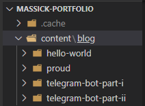
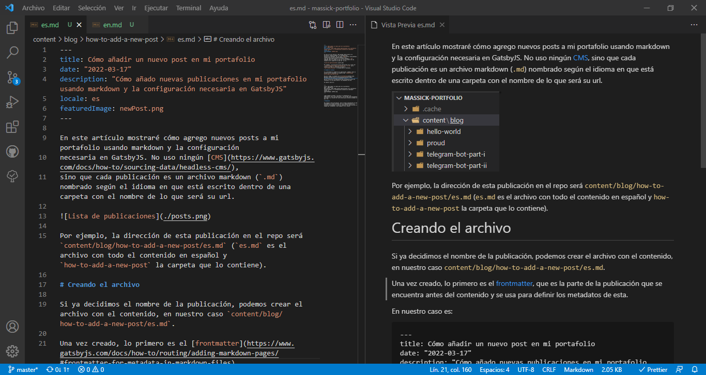
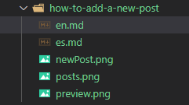

En este artículo mostraré cómo agrego nuevos posts a mi portafolio usando markdown y la configuración
necesaria en GatsbyJS. No uso ningún [CMS](https://www.gatsbyjs.com/docs/how-to/sourcing-data/headless-cms/),
sino que cada publicación es un archivo markdown (`.md`) nombrado según el idioma en que está escrito dentro de una carpeta con el nombre de lo que será su url.



Por ejemplo, la dirección de esta publicación en el repo será `content/blog/how-to-add-a-new-post/es.md` (`es.md` es el archivo con todo el contenido en español y `how-to-add-a-new-post` la carpeta que lo contiene).

# Creando el archivo

Si ya decidimos el nombre de la publicación, podemos crear el archivo con el contenido, en nuestro caso `content/blog/how-to-add-a-new-post/es.md`.

Una vez creado, lo primero es el [frontmatter](https://www.gatsbyjs.com/docs/how-to/routing/adding-markdown-pages/#frontmatter-for-metadata-in-markdown-files),
que es la parte de la publicación que se encuentra antes del contenido y se usa para definir los metadatos de esta.

En nuestro caso es\:

```
---
title: Cómo añadir una nueva publicación en mi portafolio
date: "2022-03-17"
description: "Cómo añado nuevas publicaciones en mi portafolio usando markdown y la configuración necesaria en GatsbyJS"
locale: es
featuredImage: newPost.png
---
```

> `featuredImage` es una imagen que se usará como miniatura de la publicación y que se encuentra en la misma carpeta que este archivo

Luego podemos proceder a escribir el contenido de la publicación. Podemos usar imágenes y otros tipos de archivos que agreguemos a la carpeta donde se encuentra el archivo markdown.

En mi caso particular, uso VS Code como herramienta principal y su función de vista previa para archivos markdown es muy útil.



Una vez terminado, al guardar el archivo, GatsbyJS creará una página web con el contenido de la publicación al usar `gatsby build` (o `gatsby develop`). Ahora veremos cómo es esto posible.

# Configuración de GatsbyJS

Para que Gatsby pueda usar nuestros archivos markdown correctamente para crear las publicaciones del blog, debemos usar algunos plugins, además de configurarlos con este fin.

## Plugins

```js
    //gatsby-config.js
    {
      resolve: `gatsby-source-filesystem`,
      options: {
        path: `${__dirname}/content/blog`,
        name: `blog`,
      },
    },
```

[`gatsby-source-filesystem`](https://www.gatsbyjs.com/plugins/gatsby-source-filesystem/) es un plugin que nos permite, entre otras cosas, usar archivos markdown como fuente de datos.
En el código anterior lo estamos configurando para que nuestros archivos `md` aparezcan en las consultas GraphQL.
También usamos [`gatsby-transformer-remark`](https://www.gatsbyjs.com/plugins/gatsby-transformer-remark/) y otros plugins de tipo Gatsby Remark para leer el contenido de los mismos.

> Puedes encontrar la lista completa de plugins utilizados en [el repo de Github](https://github.com/M4ss1ck/massick-portfolio).

Ya tenemos el contenido de nuestra publicación y podemos acceder a él, ahora debemos hacer que gatsby cree la página web asociada.

## Plantilla

En [src/templates/blog-post.js](https://github.com/M4ss1ck/massick-portfolio/blob/master/src/templates/blog-post.js) encontramos la plantilla que usaremos para cada publicación.

## Creando las páginas

En [gatsby-node.js](https://github.com/M4ss1ck/massick-portfolio/blob/master/gatsby-node.js) crearemos las páginas.
Primeramente usaremos GraphQL para obtener las publicaciones ordenadas por fecha.
Después ya seremos capaces de crear las páginas para cada una de ellas (utilizando la plantilla que creamos en el paso anterior).

En el caso particular de este portafolio y debido a la configuración de `gatsby-plugin-react-i18next`, debemos, además, redirigir `/es` a `/` usando `onCreateNode`. Puedes ver todo el código [aquí](https://github.com/M4ss1ck/massick-portfolio/blob/master/gatsby-node.js).

# Conclusiones

Hemos podido ver todos los archivos necesarios para crear esta publicación, además de la configuración que permitió que el contenido de los archivos markdown (`.md`), y de algunas imágenes, se convirtieran en fantásticas páginas web.



Aunque pueda parecer mucho trabajo, sólo debe hacerse una vez, para nuevas publicaciones simplemente se entra a `content/blog` y se crea una nueva carpeta con lo que será el nuevo enlace.
Luego se crean los archivos markdown para cada idioma y se agregan imágenes y otros archivos en caso de ser necesario.
