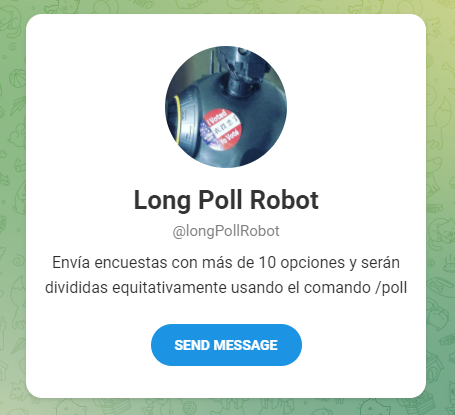
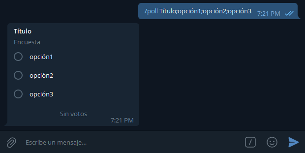
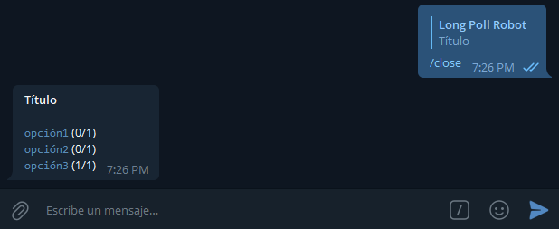
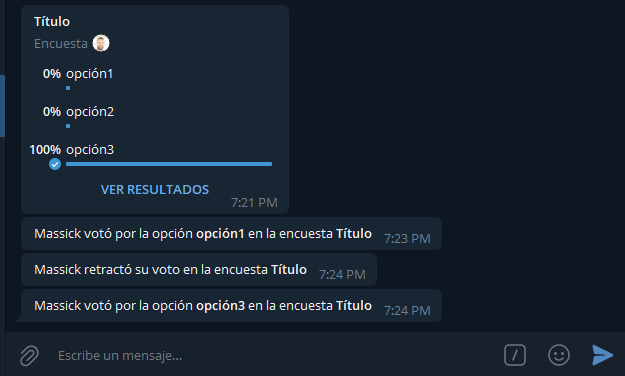
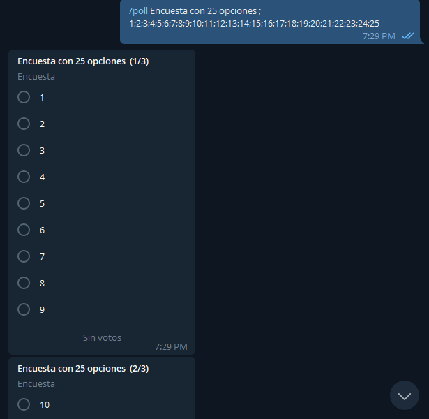

In [previous articles](/blog/telegram-bot-part-i) we saw how to create a Telegram bot using the telebot library. This time we will use [telegraf](https://telegraf.js.org/) to recreate [longPollRobot](http://t.me/longPollRobot), a simple bot that makes it easy for us to create polls in Telegram.



> Send polls with more than 10 options and they will be equally divided using `/poll` command

# First steps

The first thing is to organize our work environment: we need a text editor and have [Node.js](https://nodejs.org/) installed, as well as a Telegram account.

We create a folder where we will store our code with the name we want to give to the project and add some files that I will put below:

## `package.json`

```json
{
  "name": "longpollrobot",
  "version": "1.0.0",
  "description": "Bot for polls with many options in Telegram",
  "main": "main.js",
  "scripts": {
    "start": "node -r dotenv/config main.js"
  },
  "author": "M4ss1ck",
  "license": "MIT",
  "type": "module",
  "dependencies": {
    "dotenv": "^10.0.0",
    "telegraf": "^4.5.2"
  }
}
```

In this file we specify some metadata of our project. Here the most important details are

1. the dependencies: `dotenv` to use environment variables, that is, not to write directly in the code our credentials or those of the bot, and `telegraf` to communicate with the Telegram Bot API.
2. our `start` script: the command we will use to start our bot.

## `.env`

```
BOT_TOKEN=1234567890:AAFbuYsrLW3Q88HsqghTREsgqJXItueZ2jQ
ADMIN_ID=123414579
```

BOT_TOKEN: we get it from [@BotFather](http://t.me/BotFather).
ADMIN_ID: our Telegram id, so that some commands can only be executed by us.

## `.gitignore`

```
node_modules
.env
```

This file is used so that when we decide to create a repository in github, the `node_modules` folder, as well as our `.env` file, won't be synced.

## `main.js`

Here we will write the code for our bot, we can leave it blank for now.

## Installing dependencies

To install the dependencies you only have to execute in the project folder the command according to your preferences.

```
npm i
// or
yarn
// or
pnpm i
```

It is likely that when you read this, the latest versions of `dotenv` and `telegraf` are not the ones listed in `package.json`, in which case you can use:

```
npm install dotenv telegraf
// or
yarn add dotenv telegraf
// or
pnpm add dotenv telegraf
```

# Writing the code

We are now ready to dive into our `main.js` file and shape our bot.

Our first lines will be

```js
import { Telegraf } from "telegraf"

const bot = new Telegraf(process.env.BOT_TOKEN)

bot.launch()
console.log("BOT LAUNCHED")

// Enable graceful stop
process.once("SIGINT", () => bot.stop("SIGINT"))
process.once("SIGTERM", () => bot.stop("SIGTERM"))
```

But the bot still doesn't do anything... Let's fix that.

## `/start` command

When someone uses our bot for the first time, it starts it by using this `start` command that all bots come with by default. If we don't have it configured, it doesn't do anything, so let's add it.

```js
bot.command("start", ctx => {
  ctx.replyWithHTML(
    `<b>Hi, ${ctx.message.from.first_name}!</b>\nSend <code>/poll Title;option 1;option 2;...</code> in order to create a public poll`
  )
})
```

Now when users send `/start` (or use the bot for the first time in private), they will receive a reply with some instructions.

## `/ping` command

I always like to know how long the bot has been active, let's create a `/ping` command that returns this information.

To do this we will save the time when the bot starts using `performance.now()` and we do the same when using the `/ping` command, the difference between the two tells us how long it has been active.

```js
const start = performance.now()

bot.command("ping", ctx => {
  const time = elapsedTime(start)
  const botUsername = ctx.me
  const botInfo = JSON.stringify(ctx.botInfo)
    .replace(/"/g, "")
    .replace(/,/g, ",\n")
  console.log(botInfo)
  ctx.reply(`[@${botUsername}] Active time: ${time}`)
})

const elapsedTime = start => {
  const now = performance.now()
  const active = now - start
  // give the result in dependence on time
  if (active > 60 * 60 * 1000) {
    const value = roundToAny(active / 3600000, 2)
    const hours = Math.floor(value)
    const minutes = roundToAny((value - hours) * 60, 0)
    return `${hours} h ${minutes} min`
  } else if (active > 60000) {
    const value = roundToAny(active / 60000, 2)
    const minutes = Math.floor(value)
    const seconds = roundToAny((value - minutes) * 60, 0)
    return `${minutes} min ${seconds} s`
  } else {
    return `${roundToAny(active / 1000, 1)} s`
  }
}

function roundToAny(num, n = 2) {
  return +(Math.round(num + `e+$${n}`) + `e-${n}`)
}
```

> `elapsedTime()` is a function that takes a date as a parameter and returns the elapsed time as a string.

## Working with polls

The idea is to create polls with an arbitrary number of options: as many as we can type in a message (the limit in Telegram is 10 options, so we will actually split the poll we want into several Telegram polls). The command we will use is `/poll`, and following it, the content of the poll will be interpreted separated by `';'`, first the title and then the options. Example: `/poll Title;option1;option2;option3`. We will also save some data from each poll for later use.

```js
let poll = []

bot.command("poll", async ctx => {
  const text = ctx.message.text.substring(6)
  if (text.length > 0) {
    const arr = text.split(";")
    if (arr.length < 3) {
      ctx.reply("Not enough options")
    } else {
      const question = arr[0].length > 250 ? arr[0].substring(0, 250) : arr[0]
      const options = arr
        .slice(1)
        .map(element =>
          element.length > 100 ? element.substring(0, 100) : element
        )
      const extra = {
        is_anonymous: false,
      }
      const size = options.length
      const poll_count = Math.ceil(size / 10)
      const part = Math.ceil(options.length / poll_count)
      for (let i = 0; i < poll_count; i++) {
        let option = options.slice(part * i, part * (i + 1))
        const current_question =
          poll_count > 1 ? `${question} (${i + 1}/${poll_count})` : question
        await ctx.telegram
          .sendPoll(ctx.chat.id, current_question, option, extra)
          .then(res => {
            const poll_chat = res.chat.id
            const poll_id = res.poll.id
            polls.push({
              chat: poll_chat,
              id: poll_id,
              options: option,
              question: current_question,
            })
          })
      }
    }
  } else {
    ctx.reply("Add a title and options")
  }
})
```



We will create the commands `/close` and `/cerrar` in order to close the polls created with the bot

```js
bot.command(["close", "cerrar"], async ctx => {
  if (ctx.message.reply_to_message && ctx.message.reply_to_message.poll) {
    bot.telegram
      .stopPoll(ctx.chat.id, ctx.message.reply_to_message.message_id)
      .then(res => {
        let text = `<b>${res.question}</b>\n`
        const total = res.total_voter_count
        res.options.map(
          e => (text += `\n<code>${e.text}</code> (${e.voter_count}/${total})`)
        )

        ctx.replyWithHTML(text)
      })
      .catch(err => {
        console.log(err)
        ctx.reply("I can't close this poll")
      })
  }
})
```



Now we want that every time someone votes, the bot notifies it. For example: "X has voted Y in poll Z"

```js
bot.on("poll_answer", async ctx => {
  const id = ctx.pollAnswer.poll_id
  const encuesta = encuestas.find(element => element.id === id)
  if (encuesta !== undefined) {
    const user = ctx.pollAnswer.user.first_name
    const option = ctx.pollAnswer.option_ids[0]
    const option_text = encuesta.options[option]
    const text =
      option === undefined
        ? user +
          " retracted his vote in the poll <b>" +
          encuesta.question +
          "</b>"
        : user +
          " voted for <b>" +
          option_text +
          "</b> in <b>" +
          encuesta.question +
          "</b>"
    await bot.telegram.sendMessage(encuesta.chat, text, { parse_mode: "HTML" })
  }
})
```



> bot messages when someone votes or retracts his vote (in Spanish)

## Extra

To use our `ADMIN_ID` variable, we will create a `/quit` command that allows us (only us) to remove the bot from a group we are both in.

```js
const my_id = process.env.ADMIN_ID

bot.command("quit", ctx => {
  if (ctx.message.from.id.toString() == my_id) {
    ctx
      .reply("I left 👋")
      .then(() => ctx.telegram.leaveChat(ctx.message.chat.id))
  }
})
```

# Making sure everything is ok

We have created a bot, quite simple, to make polls in Telegram. To test that it works correctly, just run our `start` script:

```
npm run start
// or
yarn start
// or
pnpm start
```



> Poll with 25 options

The full code for this bot can be found [here](https://github.com/M4ss1ck/longPollRobot), but you can also [use it on Telegram](http://t.me/longPollRobot). This is a first version, soon we will add options and commands to protect the polls so they can't be resent, allow multiple options, set a time limit to close the poll... among other things.

I hope this article has been useful 👋
