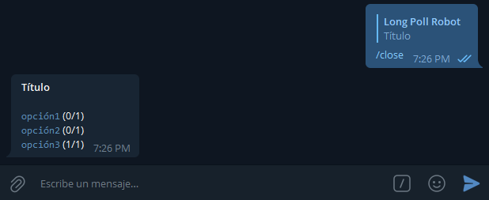
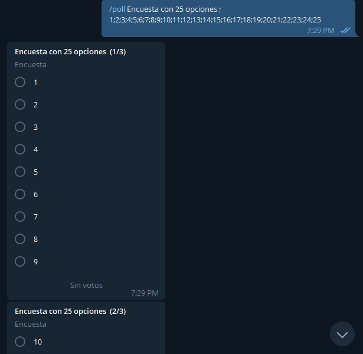

En [artículos anteriores](/blog/telegram-bot-part-i) vimos cómo crear un bot de Telegram usando la librería telebot. En esta ocasión usaremos [telegraf](https://telegraf.js.org/) para recrear [longPollRobot](http://t.me/longPollRobot), un sencillo bot que nos facilita la tarea de crear encuestas en Telegram.


# Primeros pasos

Lo primero es organizar nuestro entorno de trabajo: necesitamos un editor de texto y tener instalado [Node.js](https://nodejs.org/), además de una cuenta de Telegram.

Creamos una carpeta donde almacenaremos nuestro código con el nombre que deseemos darle al proyecto y agregamos algunos archivos que pondré a continuación:

## `package.json`

```json
{
  "name": "longpollrobot",
  "version": "1.0.0",
  "description": "Bot for polls with many options in Telegram",
  "main": "main.js",
  "scripts": {
    "start": "node -r dotenv/config main.js"
  },
  "author": "M4ss1ck",
  "license": "MIT",
  "type": "module",
  "dependencies": {
    "dotenv": "^10.0.0",
    "telegraf": "^4.5.2"
  }
}
```

En este archivo especificamos algunos metadatos de nuestro proyecto. Aquí los detalles más importantes son

1. las dependencias: `dotenv` para usar variables de entorno, esto es, no escribir directamente en el código nuestras credenciales o las del bot, y `telegraf` para comunicarnos con la Bot API de Telegram.
2. nuestro script `start`: el comando que usaremos para iniciar nuestro bot.

## `.env`

```
BOT_TOKEN=1234567890:AAFbuYsrLW3Q88HsqghTREsgqJXItueZ2jQ
ADMIN_ID=123414579
```

BOT_TOKEN: lo obtenemos de [@BotFather](http://t.me/BotFather).
ADMIN_ID: nuestro id de Telegram, para que algunos comandos sólo podamos ejecutarlos nosotros.

## `.gitignore`

```
node_modules
.env
```

Este archivo nos sirve para que cuando decidamos crear un repositorio en github, la carpeta `node_modules`, así como nuestro archivo `.env`, sean ignorados a la hora de sincronizar.

## `main.js`

Aquí escribiremos el código de nuestro bot, por ahora podemos dejarlo en blanco.

# Instalando dependencias

Para instalar las dependencias sólo debes ejecutar el comando conveniente según tus preferencias en la carpeta del proyecto.

```
npm i
// or
yarn
// or
pnpm i
```

Es probable que cuando leas esto las últimas versiones de `dotenv` y `telegraf` no sean las que aparecen en `package.json`, en cuyo caso puedes utilizar:

```
npm install dotenv telegraf
// or
yarn add dotenv telegraf
// or
pnpm add dotenv telegraf
```

# Escribiendo el código

Ya estamos listos para sambullirnos en nuestro archivo `main.js` y darle forma a nuestro bot.

Nuestras primeras líneas serán

```js
import { Telegraf } from "telegraf"

const bot = new Telegraf(process.env.BOT_TOKEN)

bot.launch()
console.log("BOT INICIADO")

// Enable graceful stop
process.once("SIGINT", () => bot.stop("SIGINT"))
process.once("SIGTERM", () => bot.stop("SIGTERM"))
```

Pero todavía el bot no hace nada... Solucionemos eso.

## Comando `/start`

Cuando alguien usa nuestro bot por primera vez, lo inicia haciendo uso de este comando `start` que traen todos los bots por defecto. Si no lo tenemos configurado, no hace nada, así que agreguémoslo.

```js
bot.command("start", ctx => {
  ctx.replyWithHTML(
    `<b>Hola, ${ctx.message.from.first_name}!</b>\nEnvía <code>/poll Titulo de la encuesta;opción 1;opción 2;...</code> para crear una encuesta pública`
  )
})
```

Ahora cuando alguien envíe `/start` (o use el bot por primera vez en privado), recibirá un mensaje de respuesta con algunas instrucciones.

## Comando `/ping`

Siempre me gusta saber cuánto tiempo lleva activo el bot, creemos un comando `/ping` que nos devuelva esta información.

Para ello guardaremos el momento en que arranca el bot usando `performance.now()` y hacemos lo mismo al usar el comando `/ping`, la diferencia entre ambos nos dice cuánto tiempo lleva activo.

```js
const inicio = performance.now()

bot.command("ping", ctx => {
  const tiempo = elapsedTime(inicio)
  const botUsername = ctx.me
  const botInfo = JSON.stringify(ctx.botInfo)
    .replace(/"/g, "")
    .replace(/,/g, ",\n")
  console.log(botInfo)
  ctx.reply(`[@${botUsername}] Tiempo activo: ${tiempo}`)
})

const elapsedTime = inicio => {
  const ahora = performance.now()
  const activo = ahora - inicio
  // dar el resultado en dependencia del tiempo
  if (activo > 60 * 60 * 1000) {
    const valor = roundToAny(activo / 3600000, 2)
    const horas = Math.floor(valor)
    const minutos = roundToAny((valor - horas) * 60, 0)
    return `${horas} h ${minutos} min`
  } else if (activo > 60000) {
    const valor = roundToAny(activo / 60000, 2)
    const minutos = Math.floor(valor)
    const segundos = roundToAny((valor - minutos) * 60, 0)
    return `${minutos} min ${segundos} s`
  } else {
    return `${roundToAny(activo / 1000, 1)} s`
  }
}

function roundToAny(num, n = 2) {
  return +(Math.round(num + `e+${n}`) + `e-${n}`)
}
```

> `elapsedTime()` es una función que tiene una fecha como parámetro y devuelve el tiempo transcurrido en forma de texto (string)

## Trabajando con las encuestas

La idea es crear encuestas con una cantidad de opciones arbitraria: todas las que podamos escribir en un mensaje (el límite en Telegram son 10 opciones, así que en realidad dividiremos la encuesta que queremos en varias encuestas de Telegram). El comando que usaremos es `/poll`, y a continuación del mismo, se interpretará el contenido de la encuesta separado por `';'`, primero el título y luego las opciones. Ejemplo: `/poll Título;opción1;opción2;opción3`. También guardaremos algunos datos de cada encuesta para usar más adelante.

```js
let encuestas = []

bot.command("poll", async ctx => {
  const text = ctx.message.text.substring(6)
  if (text.length > 0) {
    const arr = text.split(";")
    if (arr.length < 3) {
      ctx.reply("No hay suficientes opciones")
    } else {
      const question = arr[0].length > 250 ? arr[0].substring(0, 250) : arr[0]
      const options = arr
        .slice(1)
        .map(element =>
          element.length > 100 ? element.substring(0, 100) : element
        )
      const extra = {
        is_anonymous: false,
      }
      const size = options.length
      const poll_count = Math.ceil(size / 10)
      const part = Math.ceil(options.length / poll_count)
      for (let i = 0; i < poll_count; i++) {
        let option = options.slice(part * i, part * (i + 1))
        const current_question =
          poll_count > 1 ? `${question} (${i + 1}/${poll_count})` : question
        await ctx.telegram
          .sendPoll(ctx.chat.id, current_question, option, extra)
          .then(res => {
            const poll_chat = res.chat.id
            const poll_id = res.poll.id
            encuestas.push({
              chat: poll_chat,
              id: poll_id,
              options: option,
              question: current_question,
            })
          })
      }
    }
  } else {
    ctx.reply("Añade un título y opciones para la encuesta")
  }
})
```


Crearemos los comandos `/close` y `/cerrar` con el fin de cerrar las encuestas creadas con el bot

```js
bot.command(["close", "cerrar"], async ctx => {
  if (ctx.message.reply_to_message && ctx.message.reply_to_message.poll) {
    bot.telegram
      .stopPoll(ctx.chat.id, ctx.message.reply_to_message.message_id)
      .then(res => {
        let text = `<b>${res.question}</b>\n`
        const total = res.total_voter_count
        res.options.map(
          e => (text += `\n<code>${e.text}</code> (${e.voter_count}/${total})`)
        )

        ctx.replyWithHTML(text)
      })
      .catch(err => {
        console.log(err)
        ctx.reply("No puedo cerrar la encuesta")
      })
  }
})
```



Ahora queremos que cada vez que alguien vote, el bot lo notifique. Ejemplo: "Fulano ha votado por la opción X en la encuesta Y"

```js
bot.on("poll_answer", async ctx => {
  const id = ctx.pollAnswer.poll_id
  const encuesta = encuestas.find(element => element.id === id)
  if (encuesta !== undefined) {
    const user = ctx.pollAnswer.user.first_name
    const option = ctx.pollAnswer.option_ids[0]
    const option_text = encuesta.options[option]
    const text =
      option === undefined
        ? user +
          " retractó su voto en la encuesta <b>" +
          encuesta.question +
          "</b>"
        : user +
          " votó por la opción <b>" +
          option_text +
          "</b> en la encuesta <b>" +
          encuesta.question +
          "</b>"
    await bot.telegram.sendMessage(encuesta.chat, text, { parse_mode: "HTML" })
  }
})
```


## Extra

Para usar nuestra variable `ADMIN_ID`, crearemos un comando `/quit` que nos permita (sólo a nosotros) sacar al bot de un grupo en que estemos ambos.

```js
const my_id = process.env.ADMIN_ID

bot.command("quit", ctx => {
  if (ctx.message.from.id.toString() == my_id) {
    ctx
      .reply("Me fui 👋")
      .then(() => ctx.telegram.leaveChat(ctx.message.chat.id))
  }
})
```

# Prueba de fuego

Hemos creado un bot, bastante simple, para hacer encuestas en Telegram. Para probar que funciona correctamente, basta con correr nuestro script `start`:

```
npm run start
// or
yarn start
// or
pnpm start
```



El código completo de este bot lo puedes encontrar [aquí](https://github.com/M4ss1ck/longPollRobot), o puedes [usarlo en Telegram](http://t.me/longPollRobot). Esta es una primera versión, próximamente agregaremos opciones y comandos para proteger las encuestas y que no puedan ser reenviadas, permitir múltiples opciones, establecer un tiempo límite para cerrar la encuesta, entre otras cosas.

Espero que este artículo te haya sido útil 👋
