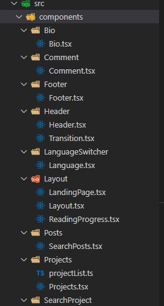
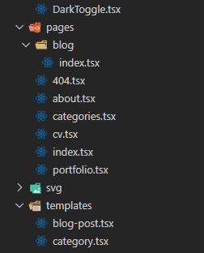
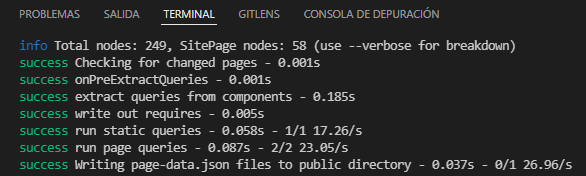

> Empiezo hoy, pero no sé cuando terminaré.

<p align="right"><strong>Massick</strong></p>

# TL;DR

Si quieres migrar un proyecto hecho en [Gatsby](https://www.gatsbyjs.com/) de JavaScript a TypeScript, esta publicación te puede ayudar. También puedes revisar directamente [el repositorio](https://github.com/M4ss1ck/massick-portfolio).

# Las razones 💭

Este portafolio va de lo que, en mi rol de desarrollador, soy capaz de crear, así que definitivamente voy a pasar de JS a TS para mejorar mis habilidades con el lenguaje y de paso mejorar también la experiencia mientras trabajo. Y es que trabajar con **TypeScript** es lo máximo, _al menos cuando ya he corregido todos los problemas y voy a crear algo nuevo_.

Ya esto lo hice antes con [mi generador de currículos](https://github.com/M4ss1ck/gatsby-cv-maker) y me fue bien, además, **TypeScript** es una habilidad que, como desarrollador web, conviene aprender. La diferencia es que aquí son muchos más archivos y debe ser mucho más complejo 🚶‍♂️

# Antes 👀

Los archivos que debo convertir de JS a TS son:

- Los componentes de `src/components`.


- Las diferentes rutas del sitio en `src/pages`.


- Plantillas para las publicaciones del blog y las categorías en `src/templates`.


En cuanto a los archivos de configuración específicos de gatsby (`gatsby-*.js`), de momento los dejaré como están.

# Primeros pasos 👣

Lo primero es instalar los paquetes necesarios, en mi caso sería:

```bash
# npm
npm i -D @types/react-transition-group @types/react-helmet @types/node @types/react @types/react-dom typescript
# yarn
yarn add -D @types/react-transition-group @types/react-helmet @types/node @types/react @types/react-dom typescript
# pnpm
pnpm add -D @types/react-transition-group @types/react-helmet @types/node @types/react @types/react-dom typescript
```

Y ahora toca lo bueno: cambiar las extensiones de `.js` a `.ts` o `.tsx` y solucionar problemas 😅

# Migrando 🛫 🛬

Lo primero es copiar el archivo `tsconfig.json` de mi proyecto [cv-maker](https://github.com/M4ss1ck/gatsby-cv-maker). Luego comencé a cambiar la extensión de los archivos en `src/components` de `.js` a `.tsx` y solucionar los errores a medida que fueran apareciendo.


En mi componente `Footer.tsx` importaba archivos `.svg` como componentes de react, lo que provocaba un error: **No se encuentra el módulo "../svg/name.svg" ni sus declaraciones de tipos correspondientes**. La solución fue crear el archivo `src/custom.d.ts` con el siguiente código:

```ts
declare module "*.svg" {
  const content: React.FunctionComponent<React.SVGAttributes<SVGElement>>
  export default content
}
```

Con esto es suficiente, ya que nuestro `tsconfig.json` tiene la línea `"include": ["./src/**/*"]`.

El error más común en el resto de los archivos fue en cuanto al tipo de los parámetros de los componentes de react. Tomemos por ejemplo la plantilla `blog-post.tsx`:

Lo que era

```js
import React from "react"
...
const BlogPostTemplate = ({ data, location }: Props) => {
  const post = data.markdownRemark
  ...
  return (
    ...
  )
}

export default BlogPostTemplate
...
```

Pasó a ser

```ts
import React from "react"
...
interface Props {
  data: {
    site: {
      siteMetadata: {
        title: string
      }
    }
    locales: {
      edges: {
        node: {
          ns: string
          data: any
          language: string
        }
      }
    }
    markdownRemark: {
      id: string
      excerpt: string
      html: any
      frontmatter: {
        title: string
        date: string
        description: string
        locale: string
        categories: string
        featuredImage: {
          childImageSharp: {
            gatsbyImageData: any
          }
        }
      }
      timeToRead: string
    }
    previous: {
      fields: {
        slug: string
      }
      frontmatter: {
        title: string
      }
    }
    next: {
      fields: {
        slug: string
      }
      frontmatter: {
        title: string
      }
    }
  }
  location: Location
}

const BlogPostTemplate = ({ data, location }: Props) => {
  const post = data.markdownRemark
  ...
  return (
    ...
  )
}

export default BlogPostTemplate
...
```

Y de la misma forma para cada archivo en dependencia de la consulta de graphQL 😅

Fue trabajoso, pero no especialmente difícil. Tampoco fue un paseo de rosas... Muchas veces fue a base de prueba y error.

Mención especial para `Canvas.tsx`

```ts
const canvasRef = useRef() as React.RefObject<HTMLCanvasElement>

const ctx = canvas.getContext("2d") as CanvasRenderingContext2D
```

Confío en que, a medida que me familiarice con el lenguaje, todo será más fácil 🤞

# Resultados 🎉

Y así quedó el explorador de archivos después de renombrar los archivos, corregir errores y reordenar un poco:





La mejor confirmación de que todo fue bien fue no ver errores en la consola y darle la bienvenida una vez más a la página principal de mi portafolio 🤩




Recuerda que puedes ver cómo quedó todo en [el repositorio del proyecto](https://github.com/M4ss1ck/massick-portfolio).

# Pendientes 😒

Me hubiera gustado migrar **todos** los archivos JavaScript, pero en este primer momento me quedaron fuera los archivos de configuración: algunos de Gatsby y otros de Tailwind CSS, PostCSS, etc. Tampoco sé si, en el caso de estos últimos: 1) es posible y 2) si tiene alguna utilidad práctica. Así que lo dejo para una segunda parte, cuando tenga la respuesta a esas incógnitas 🚶‍♂️

**¡Hasta la próxima!**
