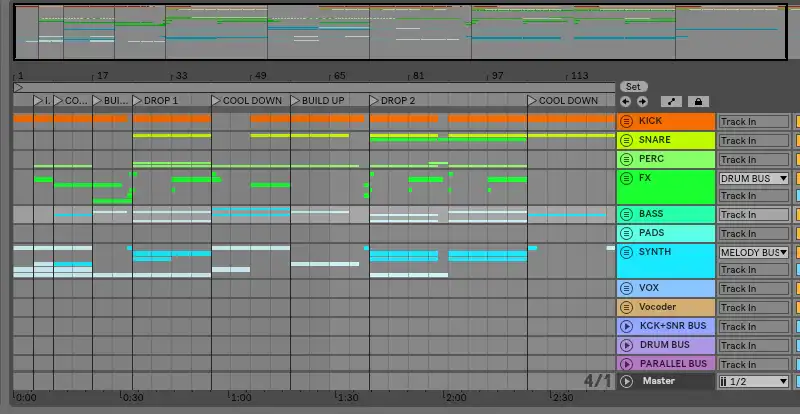

> This article was originally published in [this other blog](https://wastingblog.gatsbyjs.io/posts/nuevo-tema-proud)

Hello!

I've been making music as a hobby for many years, hence I created an account on [SoundCloud](https://soundcloud.com/m4ss1ck) to upload my creations and share them with the world. Unfortunately I haven't become famous yet....

Maybe the latter is influenced by my biography on the site:

> I'm a mathematician from Cuba who loves music. I always try to do Delta Heavy's kind of music but fail miserably, then I just do some house shit and post it here at souncloud.

But today is a special occasion, as I have just uploaded a track that I was proud of even as I was working on it. Although it was ready 5 months ago, a combination of laziness and poverty meant that I couldn't share it until today.

The song is called "Proud." **Yeah, I know, I'm super creative**. I started it in 2019, using Ableton Live 10 Suite. As I've been doing for some time, the genre is Drum and Bass (DnB), but with some additions from other genres that give it a different feel (or that impression it gives me).

Anyway, if you want to listen to it, [this is the link](https://soundcloud.com/m4ss1ck/proud). If for some reason (for example: you are a very bad person) you don't want to listen to it, [this is the link](https://soundcloud.com/m4ss1ck/proud). Comment, like, share...

Thanks for reading (if you didn't cheat).
