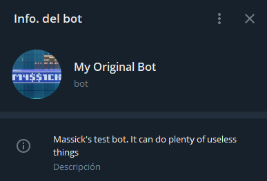
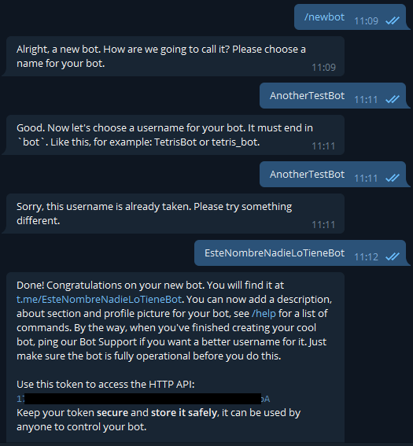
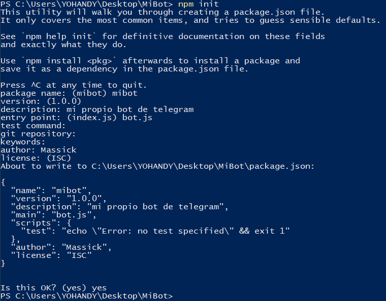

> This article was originally published [here](https://wastingblog.gatsbyjs.io/posts/telegram-bot-usando-node-telebot-y-railway)



# Intro

I've always loved everything to do with Telegram, and since I'm studying programming, I couldn't pass up the opportunity to make my own bot. And it is quite easy to do simple things, there is a lot of documentation.

# Requirements

We do not need much to achieve our purpose, I already announced at the beginning that it is really easy. We will need:

- A telegram account: necessary to create our bot.
- Install [Node.js](https://nodejs.org/): is what we will use to program our bot.
- Create an account in [railway.app](https://railway.app/): there we will host our bot. It is highly recommended that you use a Github repository for the code, that way with each commit your bot will be updated automatically.

# First steps

About the first steps there is quite a lot of information on the internet, as they are the same regardless of the programming language you decide to use: you must create your bot with @BotFather. After typing `/newbot`, you make some decisions such as the profile picture, the description...



Here the most important thing is to save the token returned by the bot, since the plugin we will use ([Telebot](https://github.com/mullwar/telebot)) needs it.

# Writing our code

This is the fun part. We have to create a folder for our project and in it open some terminal (in Windows you can do it by pressing shift + right click and selecting _"Open powershell window here"_).

With `npm init` and completing the questions, we are ready to start writing the code for our bot. We will not close the terminal yet.



Now we will create 2 new files: `bot.js` y `.gitignore`, the first one for the bot code itself and the second one to avoid uploading folders like _node_modules_ to github.

Precisely in `.gitignore` we will write

```
node_modules
package-lock.json
```

Now we have to install [Telebot](https://github.com/mullwar/telebot). Type `npm install telebot` in the terminal and wait for it to finish.

In `bot.js` we type:

```
 import TeleBot from "telebot";

const bot = new TeleBot({
  token: process.env.TG_TOKEN,
  polling: {
    // Optional. Use polling.
    interval: 1000, // Optional. How often check updates (in ms).
    timeout: 0, // Optional. Update polling timeout (0 - short polling).
    limit: 3, // Optional. Limits the number of updates to be retrieved.
    retryTimeout: 5000, // Optional. Reconnecting timeout (in ms).
  },
  usePlugins: ["commandButton", "reporter"],
  pluginConfig: {
    reporter: {
      // What to report?
      events: ["reconnect", "reconnected", "stop", "error"],
      // User list
      to: [my_id],
    },
  },
});

bot.on(/^\/say (.+)$/, (msg, props) => {
  const text = props.match[1];
  console.log(msg);
  return bot.sendMessage(msg.chat.id, text, { replyToMessage: msg.message_id });
});
```

In the previous code we initialized the library that we will use to communicate with the telegram API as well as writing a very simple command so that when using `/say anything` the bot responds `anything`.

In order not to write directly the bot token in our code, we previously used the `TG_TOKEN` variable, so now we must create a `.env` file and install [dotenv](https://github.com/motdotla/dotenv) in our project. This module allows us to load environment variables from a `.env` file to `process.env`, hence instead of writing our `1778008574:AAFbuYsrLW3Q77...` token in the `bot.js` file, we write `process.env.TG_TOKEN`.

Install dotenv

```
npm install dotenv
```

We create an `.env` file and write our variable and its value in it

```
TG_TOKEN=123456789:AAFbuKsrLW3Q77HsElI7oHGFqJXItozZ2jQ
```

There is only one simple step left to test our bot...

Let's modify `package.json` to use `dotenv`. Let's change the _start_ script as follows:

```json
"scripts": {
    "start": "node -r dotenv/config bot.js"
  },
```

Now yes, to start our bot, let's type `npm run start`.

> In a future post we will see how to host it in [railway.app](https://railway.app/) (currently it is running from our PC)
