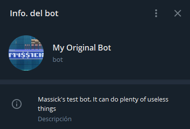
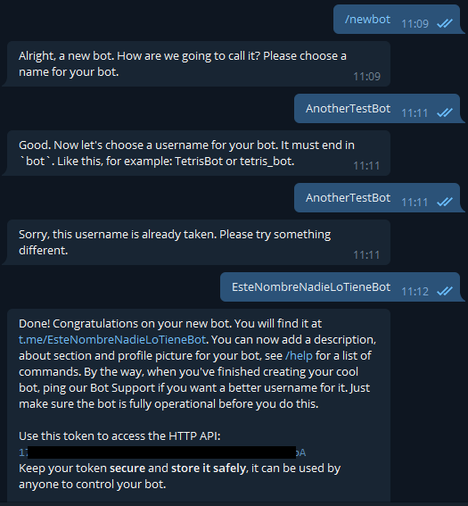

> Este artículo se publicó originalmente [aquí](https://wastingblog.gatsbyjs.io/posts/telegram-bot-usando-node-telebot-y-railway)



# Introducción

Siempre me ha gustado mucho todo lo que tiene que ver con Telegram, y desde que estoy estudiando programación, no podía dejar pasar la oportunidad de hacer mi propio bot. Y resulta bastante sencillo hacer cosas simples, hay mucha documentación. Pero no tanto así en español, por eso quiero contribuir con mi experiencia para que todo sea más fácil.

# Requisitos

No necesitamos mucho para lograr nuestro propósito, ya anunciaba al inicio que es realmente fácil. Necesitaremos:

- Tener una cuenta de telegram: necesario para crear nuestro bot.
- Instalar [Node.js](https://nodejs.org/): es lo que usaremos para programar nuestro bot.
- Crear una cuenta en [railway.app](https://railway.app/): ahí hospedaremos nuestro bot. Es muy recomendable que uses un repositorio de Github para el código, de esa forma con cada commit tu bot se actualizará de forma automática.

# Primeros pasos

Sobre los primeros pasos hay bastante información en internet, ya que son los mismos independientemente del lenguaje de programación que decidas usar: debes crear tu bot con @BotFather. Luego de escribir `/newbot`, tomas algunas decisiones como la foto de perfil, la descripción...



Aquí lo más importante es guardar el token que nos devuelve el bot, ya que el complemento que usaremos ([Telebot](https://github.com/mullwar/telebot)) lo necesita.

# Escribiendo nuestro código

Esta es la parte divertida. Tenemos que crear una carpeta para nuestro proyecto y en ella abrir alguna terminal (en el caso de Windows lo puedes hacer presionando shift + clic derecho y seleccionando "Abrir la ventana de powershell aquí").

Con npm init y completando las preguntas, estamos listos para comenzar, ahora sí, a escribir el codigo de nuestro bot. No cerraremos la terminal todavía.


Ahora crearemos 2 nuevos archivos: `bot.js` y `.gitignore`, el primero para el propio código del bot y el segundo para evitar subir a github carpetas como node_modules.

Precisamente en `.gitignore` escribiremos

```
node_modules
package-lock.json
```

Ahora tenemos que instalar [Telebot](https://github.com/mullwar/telebot). Escribimos `npm install telebot` en nuestra terminal y esperamos a que termine.

En `bot.js` escribimos:

```
 import TeleBot from "telebot";

const bot = new TeleBot({
  token: process.env.TG_TOKEN,
  polling: {
    // Optional. Use polling.
    interval: 1000, // Optional. How often check updates (in ms).
    timeout: 0, // Optional. Update polling timeout (0 - short polling).
    limit: 3, // Optional. Limits the number of updates to be retrieved.
    retryTimeout: 5000, // Optional. Reconnecting timeout (in ms).
  },
  usePlugins: ["commandButton", "reporter"],
  pluginConfig: {
    reporter: {
      // What to report?
      events: ["reconnect", "reconnected", "stop", "error"],
      // User list
      to: [my_id],
    },
  },
});

bot.on(/^\/say (.+)$/, (msg, props) => {
  const text = props.match[1];
  console.log(msg);
  return bot.sendMessage(msg.chat.id, text, { replyToMessage: msg.message_id });
});
```

En el código anterior inicializamos la librería que usaremos para comunicarnos con la API de telegram además de escribir un comando muy sencillo para que al usar `/say cualquiercosa` el bot responda `cualquiercosa`.

Para no escribir directamente el token del bot en nuestro código, anteriormente usamos la variable `TG_TOKEN`, así que ahora debemos crear un archivo `.env` e instalar [dotenv](https://github.com/motdotla/dotenv) en nuestro proyecto. Este módulo nos permite cargar variables de entorno desde un archivo `.env` a `process.env`, de ahí que en lugar de escribir nuestro token `1778008574:AAFbuYsrLW3Q77...` en el archivo `bot.js`, escribimos `process.env.TG_TOKEN`.

Instalamos dotenv

```
npm install dotenv
```

Creamos un archivo `.env` y escribimos nuestra variable y su valor en él

```
TG_TOKEN=123456789:AAFbuKsrLW3Q77HsElI7oHGFqJXItozZ2jQ
```

Sólo nos queda un simple paso para poder probar nuestro bot...

Modifiquemos `package.json` para que use `dotenv`. Cambiemos el script _start_ como a continuación:

```json
"scripts": {
    "start": "node -r dotenv/config bot.js"
  },
```

Ahora sí, para iniciar nuestro bot, escribamos `npm run start`

> En una próxima publicación veremos cómo alojarlo en [railway.app](https://railway.app/) (actualmente está corriendo desde nuestra PC)
