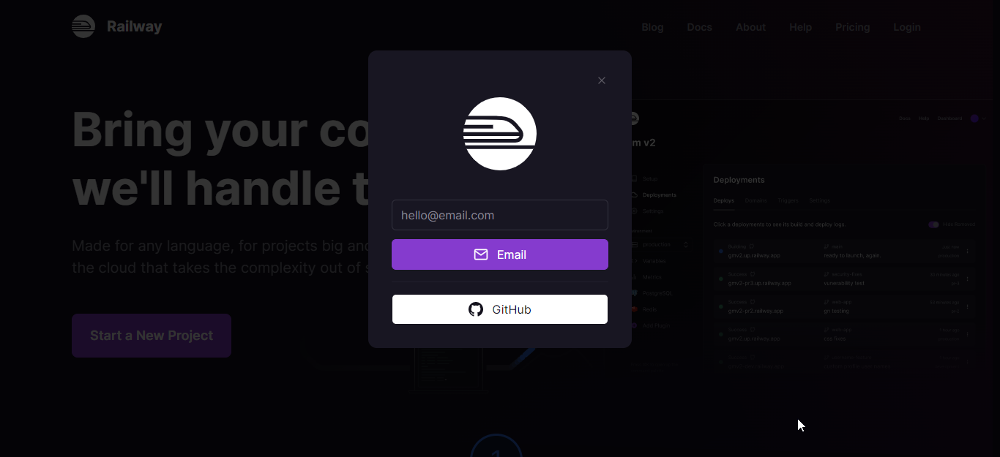
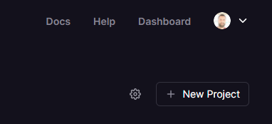
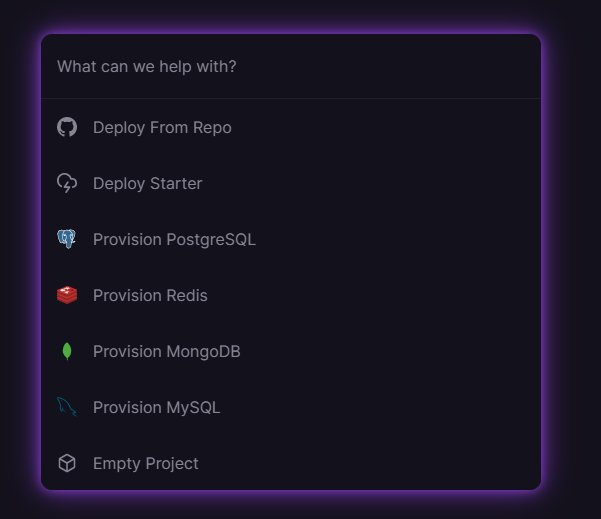
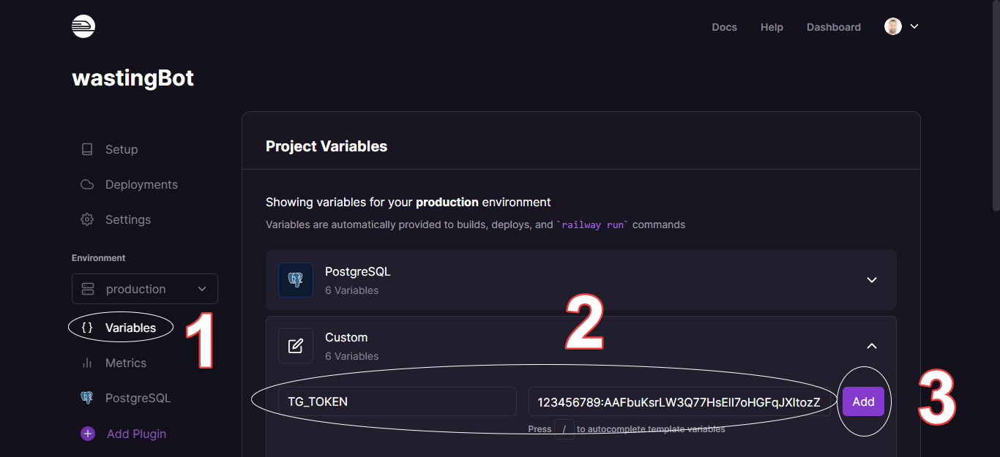

# Introduction

As you could read [earlier](/blog/telegram-bot-part-i), it is easy to create our own Telegram bot. Now we will see how to deploy it in [railway.app](https://railway.app/).

> At the time of finishing the previous article, the bot was running on our PC or laptop, what we intend now is to use some online service to not depend on our internet connection nor on our equipment.

# Requirements

- Create an account in [railway.app](https://railway.app/): there we will host our bot. It is highly recommended that you use a Github repository for the code, that way with each commit your bot will be updated automatically.

> There is a lot of information on the Internet about creating a [Github](https://github.com/) repository and it is really easy to do.

From this point on we assume that we have the code of our bot in github, in my case the repo is [https://github.com/M4ss1ck/wastingBot](https://github.com/M4ss1ck/wastingBot)

# Login to [railway.app](https://railway.app/)

We can use any email address for our account, although I preferred to use the github integration.

# New project

When accessing our [control panel](https://railway.app/dashboard), at the top right we have a **New Project** button that will allow us to create a new project: in this case, our bot.

In the following options (image above) we select **Deploy from repo** and answer the questions we will be asked, ensuring that the application has access to our repo (if it doesn't already). Once this step is finished, our bot is almost ready.

# Environment variables

We just need to introduce our `TG_TOKEN` variable, for which we select **Variables** on the left, then we add `TG_TOKEN` and its value, and finally we click on the **Add** button, as shown in the following image:

# All done

If everything went well, when we go to the **Deployments** tab, a green circle indicates that everything was successful. We already have our bot operational.

# Pending

At this point, our bot is ready, but it is very simple and has limited functionality. But that doesn't matter, because every time you add/modify commands and update the github repository, the changes will be applied automatically without you having to do anything. You will also be notified by mail in case of failures.

To see what else you can do with [Telebot](https://github.com/mullwar/telebot), I recommend looking at the [examples](https://github.com/mullwar/telebot/tree/master/examples). You can also check out [my bot for everything](https://github.com/M4ss1ck/wastingBot).

Railway offers much more than what we've seen so far, so I recommend checking out their [documentation](https://docs.railway.app/).
