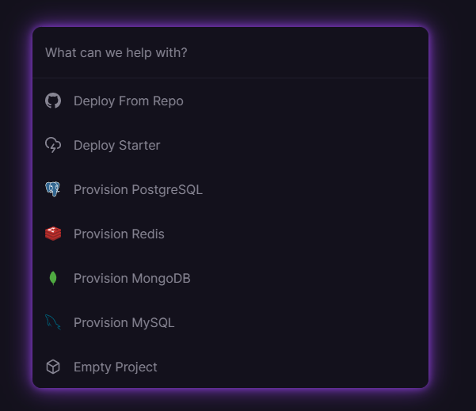
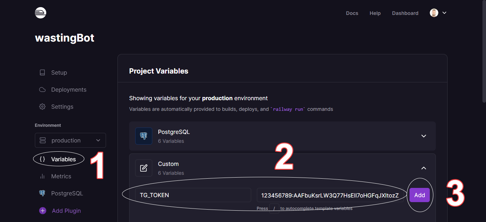

# Introducción

Como pudiste leer [anteriormente](/blog/telegram-bot-part-i), es fácil crear nuestro propio bot de Telegram. Ahora veremos cómo desplegarlo en [railway.app](https://railway.app/).

> Al momento de finalizar el artículo anterior, el bot estaba funcionando en nuestra PC o laptop, lo que pretendemos ahora es usar algún servicio en línea para no depender de nuestra conexión a internet ni de dicho equipo.

# Requisitos

- Crear una cuenta en [railway.app](https://railway.app/): ahí hospedaremos nuestro bot. Es muy recomendable que uses un repositorio de Github para el código, de esa forma con cada commit tu bot se actualizará de forma automática.

> Sobre crear un repositorio de [Github](https://github.com/) hay bastante información en Internet y es realmente fácil de hacer.

A partir de este momento asumimos que tenemos el código de nuestro bot en github, en mi caso el repo es [https://github.com/M4ss1ck/wastingBot](https://github.com/M4ss1ck/wastingBot)

# Iniciar sesión en [railway.app](https://railway.app/)

Podemos usar una dirección de correo cualquiera para nuestra cuenta, aunque preferí usar la integración con github.

# Nuevo proyecto

Al acceder a nuestro [panel de control](https://railway.app/dashboard), en la parte superior derecha tenemos un botón **New Project** que nos permitirá crear un nuevo proyecto: en este caso, nuestro bot.

En las opciones que se nos ofrecen a continuación (imagen de arriba) seleccionamos **Deploy from repo** y respondemos las preguntas que nos harán, garantizando que la aplicación tenga acceso a nuestro repo (si no lo tiene ya). Una vez terminado este paso, nuestro bot está prácticamente listo.

# Variables de entorno

Sólo nos queda introducir nuestra variable `TG_TOKEN`, para lo cual a la izquierda seleccionamos **Variables**, luego agregamos `TG_TOKEN` y su valor, y por último hacemos clic en el botón **Add**, como se muestra en la siguiente imagen:

# Todo listo

Si todo fue bien, al dirigirnos a la pestaña **Deployments**, un círculo verde nos indica que todo fue un éxito. Ya tenemos nuestro bot operativo.

# Pendiente

Llegados a este punto, nuestro bot está listo, pero es muy sencillo y tiene limitada funcionalidad. Pero eso no importa, ya que cada vez que agregues/modifiques comandos y actualices el repositorio de github, los cambios serán aplicados automáticamente sin que tengas que hacer nada. También se te notificará por correo en caso de fallos.

Para ver qué más puedes hacer con [Telebot](https://github.com/mullwar/telebot), recomiendo ver los [ejemplos](https://github.com/mullwar/telebot/tree/master/examples). También puedes revisar el código de [mi bot para todo](https://github.com/M4ss1ck/wastingBot).

Railway ofrece mucho más de lo que hemos visto hasta ahora, así que recomiendo consultar su [documentación](https://docs.railway.app/).
